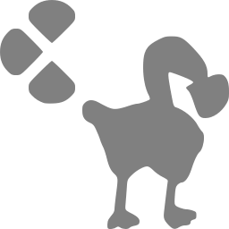

# StoicGoose




StoicGoose is a work-in-progress Bandai WonderSwan and WonderSwan Color emulator. It is written in C# via Visual Studio Community 2022 under Windows 10 Pro 21H2, and uses .NET 6.0 along with the following NuGet packages:

* [OpenTK](https://www.nuget.org/packages/OpenTK) 4.7.5 (for OpenGL rendering, OpenAL sound, etc.)
* [OpenTK.WinForms](https://www.nuget.org/packages/OpenTK.WinForms) 4.0.0-pre.6 (for WinForms OpenGL control)
* [OpenAL-Soft.Win](https://www.nuget.org/packages/OpenAL-Soft.Win) 1.2.0 (for OpenAL Soft runtime)
* [Newtonsoft.Json](https://www.nuget.org/packages/Newtonsoft.Json) 13.0.2 (for configuration, cheats and breakpoint storage)
* [GitInfo](https://www.nuget.org/packages/GitInfo) 2.3.0 (for versioning information)
* [ImGui.NET](https://www.nuget.org/packages/ImGui.NET) 1.89.4 (for debugger UI)
* [Iced](https://www.nuget.org/packages/Iced) 1.18.0 (for x86 disassembly)
* [Microsoft.CodeAnalysis.CSharp.Scripting](https://www.nuget.org/packages/Microsoft.CodeAnalysis.CSharp.Scripting) 4.4.0 (for breakpoint support)
* [Serilog](https://www.nuget.org/packages/Serilog) 2.12.0, [Serilog.Sinks.File](https://www.nuget.org/packages/Serilog.Sinks.File) 5.0.0 and [Serilog.Sinks.Console](https://www.nuget.org/packages/Serilog.Sinks.Console) 4.1.0 (for error and general message logging)

## Versions

Two flavors of StoicGoose are available:
- **StoicGoose** is the Windows Forms-based interface, meant for playing games. This build supports shaders, XInput controllers, etc.
- **StoicGoose.GLWindow** is the Dear ImGui-based interface, meant solely for debugging and disassembling games.

## Requirements

* A GPU supporting OpenGL 4.0 (ex. Nvidia GeForce 400 series or later, Radeon HD 5000 series or later, Intel Ivy Bridge iGPUs or later) _and_ appropriate drivers
* [.NET 6.0 Desktop Runtime](https://dotnet.microsoft.com/en-us/download/dotnet/6.0/runtime)
* A working implementation of OpenAL
  * ~~If the emulator fails to run because **openal32.dll** is missing, get the [OpenAL Soft](https://www.openal-soft.org/) binaries, extract the correct DLL file to the emulator directory and name it openal32.dll~~
  * This *should* no longer be necessary, due to including the OpenAL-Soft.Win NuGet package
* Optionally, copies of the WonderSwan and WonderSwan Color bootstrap ROMs (supported but not required); correct MD5 hashes are as follows
  * 54b915694731cc22e07d3fb8a00ee2db (WonderSwan)
  * 880893bd5a7d53fff826bd76a83d566e (WonderSwan Color)
  * d3eff34719a363e586e12b700501ed91 (SwanCrystal)

## Building

### Windows

* Download [Visual Studio Community 2022](https://visualstudio.microsoft.com/vs)
* Clone the StoicGoose repository
* Build and run the emulator

### Linux

* This has only been tested through Ubuntu 20.04.3 LTS via Windows Subsystem for Linux (WSL) so far, not yet on a standalone Linux installation.
* Please check [Microsoft's instructions for installing .NET on Linux](https://docs.microsoft.com/en-us/dotnet/core/install/linux) and ensure your distribution is supported.
* The Windows Forms-based interface will **not** work on Linux, only the Dear ImGui-based debugger.

To clone the StoicGoose repository:
```
$ git clone https://github.com/xdanieldzd/StoicGoose.git
```

To create and run a Debug build:
```
$ cd StoicGoose/StoicGoose.GLWindow/
$ dotnet build
$ dotnet bin/Debug/net6.0/StoicGoose.GLWindow.dll
```

To create and run a Release build:
```
$ cd StoicGoose/StoicGoose.GLWindow/
$ dotnet build -c Release
$ dotnet bin/Release/net6.0/StoicGoose.GLWindow.dll
```

## Screenshots (v000.6 WIP)

WonderSwan and WonderSwan Color Bootstraps, using Dot-Matrix and Dot-Matrix Color shaders:


Various WonderSwan games, using Dot-Matrix shader:


Various WonderSwan Color games, using Dot-Matrix Color shader:


<!--
Various debugging features (**outdated!**):

UPDATE ME ALREADY, YOU STUPID LAZY AMATEUR CODER!


-->
## Acknowledgements & Attribution

* The XML data files in `StoicGoose.WinForms\Assets\No-Intro` were created by the [No-Intro](http://www.no-intro.org) project; see the [DAT-o-MATIC website](https://datomatic.no-intro.org) for official downloads.
* The TTF file `JF-Dot-K14-2004.ttf` in `StoicGoose.GLWindow\Assets` contains the font "[K14-2004](https://ja.m.wikipedia.org/wiki/K14_%28%E3%83%95%E3%82%A9%E3%83%B3%E3%83%88%29)" by Hiroshi Tachibana and Toshiyuki Imamura, used as public domain, available as part of the [自家製ドットフォントシリーズ](http://jikasei.me/font/jf-dotfont/) from [自家製フォント工房](http://jikasei.me/).
* The file `WS-Icon.ico` in `StoicGoose.WinForms` is derived from "[WonderSwan-Black-Left.jpg](https://en.wikipedia.org/wiki/File:WonderSwan-Black-Left.jpg)" on [Wikipedia](https://en.wikipedia.org), in revision from 25 May 2014 by [Evan-Amos](https://commons.wikimedia.org/wiki/User:Evan-Amos), used as public domain.
* My personal thanks and gratitude to the late Near, who has always been encouraging and inspiring on my amateur emulator developer journey. They are sorely missed.
